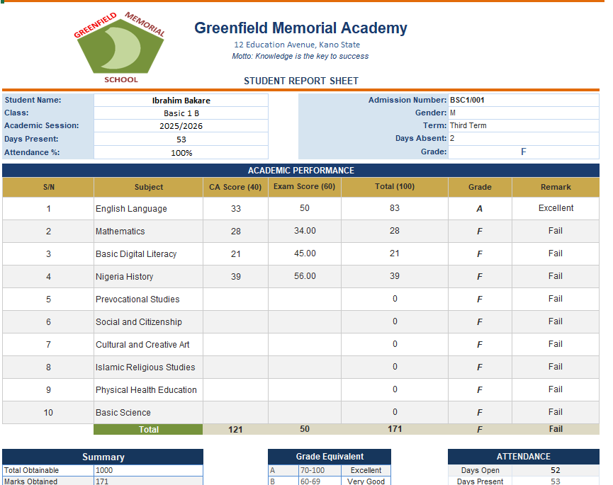

# SmartReport Sheet Builder

An automated student report card system built entirely in Excel — VBA + Power Query, no external software. Currently in live use at a secondary school for termly report generation.

## What it does

Enter each student's scores once, and the workbook generates a fully formatted, print-ready report card automatically — grades, remarks, attendance, behavioral ratings, and a class position, all computed for you.

- **One-click generation** — pick a student (or "ALL") from the control panel and export a finished report card
- **Auto grading** — scores are converted to letter grades and remarks (Excellent / Very Good / Good / Pass / Fail) from a configurable grading scale
- **Class position** — ranks each student against their class automatically
- **Behavioral & co-curricular scoring** — affective/psychomotor domains (respect, neatness, punctuality, etc.) alongside academic scores
- **Term-over-term history** — keeps prior terms' scores for comparison
- **School branding** — logo, school name, motto, and contact details pull from one settings sheet, so the whole report card re-brands itself instantly

## How it's built

| Sheet | Purpose |
|---|---|
| `SETTINGS` | School info, grading scale, term dates — the single source of truth |
| `STUDENTS` | Student master list (reg no, class, gender, attendance, contacts) |
| `SUBJECTS` | Subject list per class, with max CA score |
| `SCORE_SHEET` | CA + exam score entry, one row per student per subject |
| `PreviousTerms` | Historical scores for term-over-term comparisons |
| `Other_Performances` | Affective/psychomotor domain scores |
| `REPORT_TEMPLATE` | The generated report card layout, driven by `INDEX/MATCH` lookups against the sheets above |

Report generation is handled by a VBA macro triggered from the control panel on `REPORT_TEMPLATE`, which loops through selected students and exports each to PDF.

## Tech stack

Excel · VBA (macros) · Power Query · `INDEX/MATCH` lookups (originally `XLOOKUP`, adjusted for broader Excel-version compatibility)

## Getting started

1. Download `ReportSheet_Basic.xlsm` and open it in Excel (Windows or Microsoft 365; macros require desktop Excel — not supported in Excel for the web).
2. Click **Enable Content** on the yellow security bar.
3. Fill in your school's details on the `SETTINGS` sheet.
4. Add subjects on `SUBJECTS` and students on `STUDENTS`.
5. Enter scores on `SCORE_SHEET`.
6. Go to `REPORT_TEMPLATE`, pick a student from the dropdown, and click **Export**.

## Note on this repo copy

The version of `SETTINGS` used for sending report cards by email requires a Gmail address and a Gmail **App Password** (not your normal password — see [Google's guide](https://support.google.com/accounts/answer/185833)). Those fields are left as placeholders here — add your own if you want email delivery. All sample student data in this copy is fictional (`Student 01`, `Student 02`, ...); the real workbook in production use is not published here.

## Author

Abdulganiyu Sodeeq Adebayo
